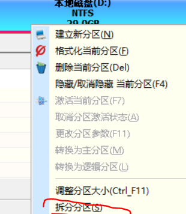
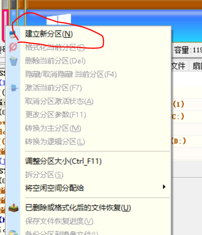
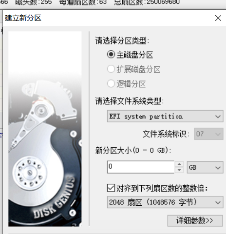

# 华为matebook14黑苹果（个人安装过程分享，仅供参考，在安装过程中造成的数据丢失，本人不负任何责任）
_PS:本项目全部文件并非全部由本人编写，要的文件也不好找出处，如果大佬看见自己的东西，觉得不合适的话请告诉我，我随时处理，给大佬添麻烦了orz，本项目的目的也是为了小白更好的吃上黑果，希望想吃黑果的小白也多多百度，爬帖子寻找答案。_


  *直接先从安装说起，首先先说，matebook14目前黑果据我了解还不算完美，所以那些想安黑果当做主力机去开发什么项目，建议放弃，不一定什么时候你在写项目时就突然崩了= =，至于想吃黑果的小白，一定要做好折腾的准备，黑果很费精神，因为你一直都想把它变得更完美，看过不少论坛的大佬告诫。。*
## 安装准备：

* 两个U盘，一个写镜像，一个写pe（pe盘是怕中途某处操作坏了还能再抢救一下）貌似pe和镜像可以写到一个盘里，但是我不会。。只有一个U盘的要相信自己的操作，或者自己百度去弄。真心建议做个pe盘
* macos镜像（自己去下）
* 微pe（我当时是拿这个做pe盘的）
* 软件diskgenius（下文都用dg表示）、easyuefi、transmac

## 开始安装：

* 硬盘分区，为了安装macos，小白自己去百度怎么分区，我就不说了= =，大小自己控制，安装macos大约也就20g左右，至于你想分多少自己把握，反正matebook14 512的硬盘（滑稽.jpg）
* pe盘制作就自己百度 微pe怎么做pe就可以了 
* 然后用U盘开始写镜像，插入U盘，打开transmac，右击自己的u盘，单击‘format disk for mac’就是格式文件，然后做好写入准备，然后右键选择‘restore with disk image’选择自己下载的镜像，然后就是漫长的等待，启动盘就做好了
* 然后重点来了，要进pe对电脑的efi分区扩容，华为的自带空间只有100m，要扩大，300m就行，这里有两个方案去扩容：1、进pe用扩容工具扩容，可用傲梅助手，用法请自行百度。2、使用dg将原efi分区删掉（在删掉之前一定要先把efi文件拷贝出来），然后在拆分出300m分区，新建成efi格式，再把原来拷贝出的efi文件放进去。我用的就是第二种方法!
* 



* efi扩容完成后，切换到win系统，然后替换mac镜像U盘的clover文件（项目里有，自己去找）
* 然后进入华为bios，fn+f2 ，先将语言设置成中文，将安全启动和安全芯片关掉，ps：这里一定要关掉，而且同时，关掉后，win下的指纹就用不了，这个暂时无解
* 开始安装：
* 开机f12选择从U盘启动，进入clover界面，选择最右边 install macos，进入安装
* 进入安装界面建议接个有线鼠标，当然可以用键盘操作，只是麻烦，键盘操作为方向键选择
tab为选择，空格为确认
* 进入界面一通选择，国家地区啥的，然后在界面选择实用工具 磁盘工具，将你准备安装的分区抹成afps格式（千万别抹错盘）


* 抹完盘退出磁盘工具，返回安装界面，直接安装，安装过程挺漫长的，还会重启几次，不要着急，如果在安装过程中提示文件损坏，请换个usb口再安装几次就可以了
* 好了系统成功安装完成
* 接下来就是设置各种东西，然后就可以进入桌面了，到这里是不是很开心呢，但别高兴太早，这才是刚刚开始


## 脱离u盘启动macos


* 即将U盘中的引导文件复制到硬盘里，从而做到脱离U盘运行
* 首先要启动Windows，在cmd下挂载引导分区
 
```diskpart
list disk           # 磁盘列表
select disk n       # 选择EFI分区所在的磁盘，n为磁盘号,这个自己可以判断
list partition      # 磁盘分区列表
select partition n  # 选择EFI分区，n为EFI分区号
assign letter=X     # x为EFI分区盘符
```
* 在dg里将U盘的clover文件拷贝到硬盘的efi分区，拷贝在dg里请用ctrl+v，选择分区，然后ctrl+v即可
* 然后就要打开easyuefi添加引导选项，这里我也是百度的，直接上截图了


* 图二那里步骤1选择分区选择自己扩容的那个分区就可以，步骤3名字随便
* 这就完成脱离U盘启动了，如果拔出U盘没法进入clover引导界面，直接进入win的话，请重新操作一次easyuefi添加引导步骤

# 进行各方面优化

## 开启hidpi （调整屏幕文字大小，更加清晰）

* 这里github上有一键开启hidpi的方法[https://github.com/xzhih/one-key-hidpi]()
* 按照开启方法一步一步来，这里一定要小心，强行设置会直接黑屏gg，按照上面github的方法来
* 设置脚本后我们发现没有适合我们电脑的分辨率，这里可以生成对应分辨率的hidpi文件，并将对应文件替换即可
* 当时百度生成文件很麻烦，就直接用大佬的生成的文件了 复制项目里的DisplayVendorID-dae 和 Icons.plist 整合起来到 /系统/资源库/Displays/Contents/Resources/Overrides/，直接替换即可


* 然后使用rdm（项目里有）直接调整分辨率

目前纵向分辨率还不能超过900，超过900会产生花屏，目前我也没有解决，等大佬 orz。

## 触控板和鼠标操作问题
* 触控板配置文件已经配置好，请直接用kext utility（项目里有），打开即可，它会自动重建缓存，稍后等它结束直接重启即可
* 鼠标问题，基本操作请直接到鼠标设置里，而调整滑轮方向请取消勾选这里


## 网卡问题
* 网卡内置的无解，你想用无线只能外接，无线网卡也很便宜，我在某宝买的也就30块，质量也还可以

## appstore问题 
* 如果App Store显示无法连接，你可直接百度 黑苹果网卡en0问题即可
* 当时我的解决方法为： 删除/library/preferences/systemconfiguration/networkinterfaces.plist 然后直接重建缓存（用kext utility），重启即可
* 没有买无线网卡建议可以用手机usb共享网络即可

## 蓝牙问题
* 蓝牙问题可用虚拟机热启动来解决，不过解决启动后，也无法识别自带的华为鼠标，自带的貌似是可以用鼠标仿冒解决，但目前还没找到成熟的方案
* 热启动就是把蓝牙推到虚拟机里，再拿回macos里，即可成功开启蓝牙，经测试除自带的蓝牙鼠标，均可连接
 
## 快捷键问题
* 这个请自觉对照mac键盘，比如这里的alt是mac的command，位置都不同，这个可以自己去修改，mac的快捷键也请自己去查找
* 声音修改快捷键可以使用，亮度快捷键请先外接usb键盘，在设置-键盘-快捷键-显示器 添加调节亮度设置

## 目前还未解决的问题
* 摄像头
* siri
* iMessage （这个不建议去搞，因为你经常用的话apple会匹配你设备）
* 独显 mx250

## 推荐爬帖子的论坛
1. 远景
2. 黑苹果乐园

-------
# 有问题的可以留言，我只是大佬的搬运工orz。。


